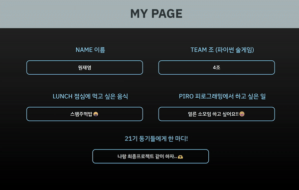

# PIRO 21ST Pull Request 세션 실습

---

# Developers

## Back-End Developers

|                                                        원피로 (BE/PM)                                                         |                                                       김피로 (BE/배포)                                                        |오피로 (BE)
| :---------------------------------------------------------------------------------------------------------------------------: | :---------------------------------------------------------------------------------------------------------------------------: |:-:|
|  |  |

## Front-End Developers

|                                                      강피로 (FE/디자인)                                                       |                                                        이피로 (FE/기획)                                                        |
| :---------------------------------------------------------------------------------------------------------------------------: | :----------------------------------------------------------------------------------------------------------------------------: |
|  |  |

- 본 페이지는 피로그래밍 21기 Fork 및 PR 실습용으로 만들어졌습니다.
